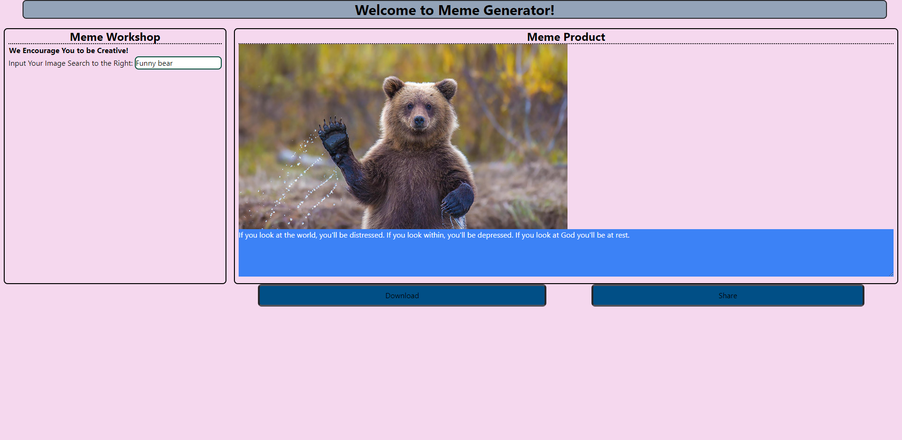

# Project-1

<<<<<<< HEAD
## DESCRIPTION:

Are you ever looking for some inspiration for the day. Tired of the same ole "You can do it" inspirational quotes. why not try our random meme generator? On any given day at any given time we have a fun way to brighten up your day with our random meme generator.
Simply type in the type of image you would like to go with your random quote and we will do the rest. Feel down? Type in something silly and get a quick pick me up meme that is sure to brighten your day. Frustrated with work. Type that in for something that is sure to make you laugh.
We have content for whatever the mood or feeling. Give it a shot and see what you can come up with. Just type a simple search in our search bar and you are garunteed a smile. feel free as well to save or share with your friends with just the touch of a button. Try our random meme generator today!

## DEVELOPERS:

Cyrus, Jeremiah, Jenny, and Max

## LINK:

Start Creating [here!]https://r31zh.github.io/Project-1/

## SCREENSHOT:

=======

elevator pitch = 

Are you ever looking for some inspiration for the day. Tired of the same ole "You can do it" inspirational quotes. why not try our random meme generator? On any given day at any given time we have a fun way to brighten up your day with our random meme generator. 

Simply type in the type of image you would like to go with your random quote and we will do the rest. Feel down? Type in something silly and get a quick pick me up meme that is sure to brighten your day. Frustrated with work. Type that in for something that is sure to make you laugh. 

We have content for whatever the mood or feeling. Give it a shot and see what you can come up with. Just type a simple search in our search bar and you are garunteed a smile. feel free as well to save or share with your friends with just the touch of a button. Try our randommemegenerator today! 

for presentation:

 Cyrus will present the code for the image generator and what challengessolutions he faces with it. Will also present the code for the download button and challenges/solutions faced. 

 Jeremiah - will show us how he got the random quotes to generate as well as how he created the share button. What challenges/solutions did you find will doing it. 

 Jenny - will show us what she had to do to change the colors and text of the page. What challenges did you come up with when learning a new CSS template like tailwinds 

 Maximus - will present us with what he did with the boxes and buttons. What challenges did you come find when learning the new css styling/solutions. 

>>>>>>> 90fd9d18d137fbf4f4b88f1bd172d8557aad2c9b
